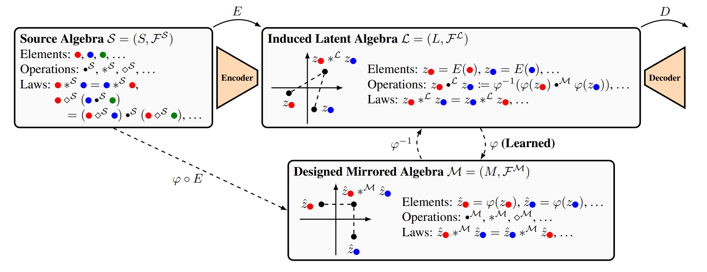

# Transport of Algebraic Structure to Latent Embeddings

This code accompanies our paper:

**Transport of Algebraic Structure to Latent Embeddings**\
Samuel Pfrommer, Brendon G. Anderson, Julien Piet, Somayeh Sojoudi\
2024 International Conference on Machine Learning (ICML)

<p align="center">
  
</p>

## Execution
To set up the environment, make a virtualenv environment `mkvirtualenv latalg`. Then run `bash setup.sh`.

Make sure to log in to a weights and biases account (free for academic users).

All scripts to reproduce the results should then be run from within `latalg` with the virtual environment activated.
```console
bash experiments/gen_data.sh
bash experiments/train_latent_model.sh
bash experiments/train_oeprator_modules.sh
bash experiments/test.sh
```

The output figures will lie in the `test_out` directory.

## Key implementations
The various combinations of candidate operations are defined in `main/algebra.py`, as are Algorithms 2 and 3 for generating terms. The parameterization of the induced latent algebra is defined in `main/operator_module.py`. The computation of metrics is defined in `_step_variables` in `main/operator_module.py`. The `data` directory contains code for generating the dataset of INRs as well as training an inr2vec encoder-decoder architecture over this dataset.
